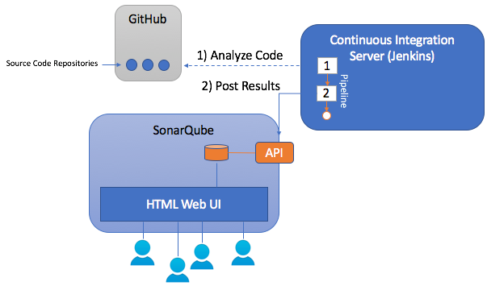

# TFRS Sonar Runner Execution Project

## Background

SonarQube is an Open Source tool suite to measure and analyse the quality of project source code.
It has been written in the Java Language however it is able to analyse code in over 20 different programming languages.
The Code Analysis may be triggered manually, monitoring commits in a source control repository, and
as part of a Continuous Integration Pipeline.  The results of an analysis are viewable in a 
modern Web Based frontend with 'green' and 'red lights', charts, and issue lists that
have the ability to be 'drilled down' into.

It is strongly recommended too review, understand and select the appropriate sonar "Quality Profiles" for each project.
(https://docs.sonarqube.org/display/SONAR/Quality+Profiles)

The Quality Profiles is core to how SonarQube can be leveraged within each project.  Essentially this is where
you will define a set of rules that project execution teams will follow, and SonarQube will execute against the project source code.

Define Rules around (just to mention a few):
* Bug Detection
* System and code Vulnerabilities
* Code Complexity ratings
* Source Code Style (look/feel)


## Architecture

SonarQube consists of two main components.  

***SonarQube Server***

>The SonarQube Server is the centralized application backed by a relational database.  
The purpose of the SonarQube Server is to <span style="color:green">a)</span> expose a set of services to send analysis data to for strage and visualization, 
and <span style="color:green">b)</span> to provide a rich Web Based User Interface for users to review and analyse project details based off the rules outlined
for each project.  

>***Think of the SonarQube as the "Queen Bee"***.

***Sonar Runner***

The Sonar Runners are distributed agents that execute source code analysis against individual projects, and connect back to a SonarQube instance and Posts the results of an individual run.

>***Think of Sonar Runner as the "Worker Bees"*** that run the analysis within each projects source code and brings the results back to the ***"Queen Bee"***.



### Gradle and Gradle Wrapper

Gradle is a modern Application build tool that helps teams build, automate and deliver better software, faster.
Gradle is an Open Source Build Automation system that builds upon the concepts of Apache Ant and Apache Maven.

The Gradle Wrapper was developed to remove the steps of installing and configuring "another tool" on developer workstations and build servers.
The Gradle Wrapper solves these steps by configuring and installing the tool by itself.  When the gradle wrapper command is executed 
it first detects if it has all dependencies to build a project, and if it does not it will download and configure first.

Example:
```java
./gradlew test
or
gradlew.bat test
```
### Jenkins Pipeline (source file)

Jenkins Pipeline is a suite of plugins which supports implementing and integrating continuous delivery pipelines into Jenkins.
Pipeline provides an extensible set of tools for modeling simple-to-complex delivery pipelines "as code" via the Pipeline DSL.

The ***Jenkinsfile***, which is checked into source control provides a number of benifits:
* Code review/iteration on the Pipeline
* Audit trail for the Pipeline
* Sintle Source of truth of the Pipeline, which can be viewd and edited by multiple members of the project.

*Retrieved from: https://jenkins.io/doc/book/pipeline/jenkinsfile/*

Generic JenkinsFile:
```js
node('maven') {
   stage('checkout tfrs-sample-sonar')
   git url: 'https://github.com/dmarley/tfrs-sonar-scanner.git'
   
   stage('list root dir')
   sh 'ls -l -srt'

   stage('change to working dir')
   dir('tfrs-sample-project'){
       stage('list dir')
       sh 'ls -l -srt'
   
       stage('execute sonar')
       sh './gradlew sonarqube -Dsonar.host.url=http://sonarqube-mem-tfrs-tools.pathfinder.gov.bc.ca -Dsonar.verbose=true --stacktrace'
   }
}
```
