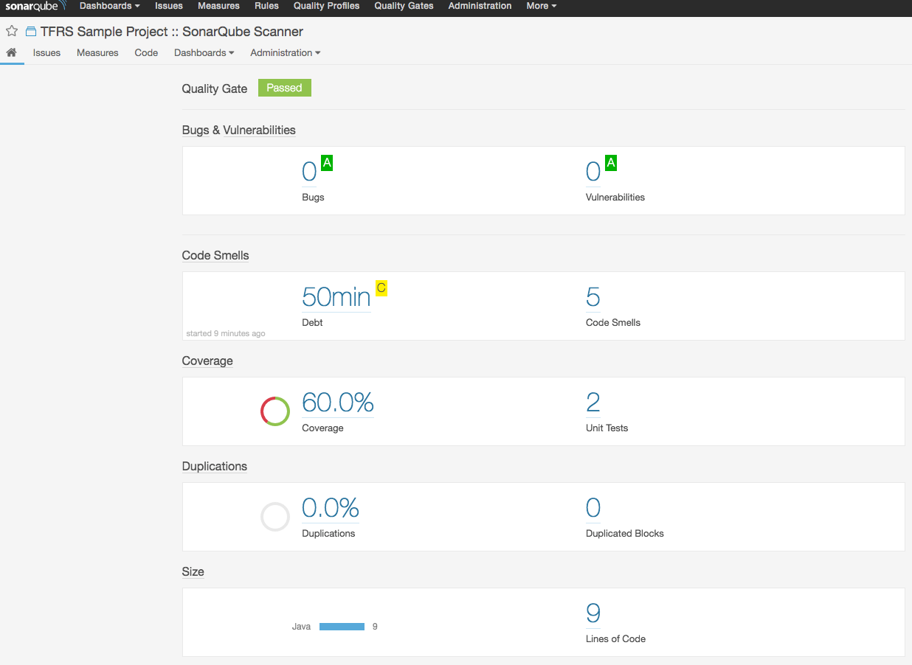

#TFRS Sonar Runner Execution Project

## Background

SonarQube is an Open Source tool suite to measure and analyse the quality of project source code.
It has been written in the Java Language however it is able to analyse code in over 20 different programming languages.
The Code Analysis may be triggered manually, monitoring commits in a source control repository, and
as part of a Continuous Integration Pipeline.  The results of an analysis are viewable in a 
modern Web Based frontend with 'green' and 'red lights', charts, and issue lists that
have the ability to be 'drilled down' into.

## Architecture

### Sonar Runner

### Gradle Wrapper

### Jenkins Pipeline (source file)

## ToDo
